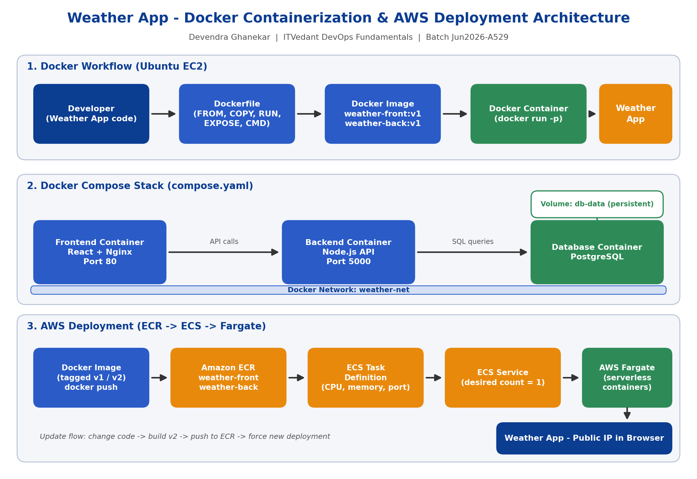

# Weather App - Docker Containerization & AWS Deployment

**ITVedant DevOps Fundamentals - Docker Mini Project**

| | |
|---|---|
| **Student Name** | Devendra Ghanekar |

---

## 1. Project Overview

This project containerizes a **Weather App** (frontend + backend) using Docker and deploys it on AWS. It covers the full Docker journey:

- Installing and managing Docker on Ubuntu (EC2)
- Writing Dockerfiles and building images
- Running and managing containers
- Running a multi-container stack with Docker Compose
- Pushing images to Amazon ECR
- Deploying on Amazon ECS with AWS Fargate

> The project was done with my own Weather App instead of the sample OpsMate service. All tasks of the project brief were followed.

---

## 2. Docker Architecture



**Docker workflow:**
`Developer → Dockerfile → Docker Image → Docker Container → Application`

**Compose architecture:**
`Frontend Container → Backend Container → Docker Network → Database Container`

**AWS architecture:**
`Developer → Dockerfile → Docker Image → Amazon ECR → ECS Task Definition → ECS Service → AWS Fargate → Weather App`

---

## 3. Tech Stack

| Component | Technology |
|---|---|
| Frontend | React (Vite) served by Nginx |
| Backend | Node.js API |
| Database | PostgreSQL (Docker Compose) |
| Containerization | Docker, Docker Compose |
| Registry | Amazon ECR |
| Orchestration | Amazon ECS with AWS Fargate |
| Server | Ubuntu EC2 |

---

## 4. Folder Structure

```
Weather-Docker-Project/
├── README.md
├── compose.yaml
├── .dockerignore
├── docker-deployment-report.txt
│
├── frontend/
│   ├── Dockerfile
│   └── src/ ...
├── backend/
│   ├── Dockerfile
│   ├── package.json
│   └── src/ ...
│
├── config/
│   └── environment.example
│
├── scripts/
│   ├── install-docker.sh
│   ├── build-image.sh
│   ├── run-container.sh
│   └── cleanup.sh
│
├── screenshots/
│   ├── docker-installation.png
│   ├── docker-daemon.png
│   ├── docker-image.png
│   ├── docker-container.png
│   ├── application-running.png
│   ├── docker-compose.png
│   ├── ecr-repository.png
│   ├── ecr-image.png
│   ├── ecs-cluster.png
│   ├── ecs-task.png
│   └── fargate-application.png
│
└── documentation/
    ├── Docker-Architecture.png
    └── Project_Report.pdf
```

---

## 5. Prerequisites

- AWS account with permissions for EC2, ECR and ECS
- Ubuntu EC2 instance (SSH access, ports 22, 80 and 5000 allowed in the security group)
- AWS CLI configured (`aws configure`)
- Git

---

## 6. Installation Steps

### Step 1 - Install Docker

```bash
chmod +x scripts/install-docker.sh
./scripts/install-docker.sh
newgrp docker
```

The script updates packages, installs Docker Engine and the Compose plugin, starts and enables the Docker service, adds the user to the `docker` group and verifies with `hello-world`.

### Step 2 - Verify Docker

```bash
docker --version
docker info
systemctl status docker
docker run hello-world
```

---

## 7. Dockerfile Explanation

### Backend (Node.js)

```dockerfile
FROM node:20-alpine
WORKDIR /app
COPY package*.json ./
RUN npm install --omit=dev
COPY . .
EXPOSE 5000
CMD ["node", "server.js"]
```

### Frontend (multi-stage: Vite build + Nginx)

```dockerfile
FROM node:20-alpine AS build
WORKDIR /app
COPY package*.json ./
RUN npm install
COPY . .
RUN npm run build

FROM nginx:alpine
COPY --from=build /app/dist /usr/share/nginx/html
EXPOSE 80
CMD ["nginx", "-g", "daemon off;"]
```

| Instruction | Purpose |
|---|---|
| `FROM` | Base image (alpine keeps the image small) |
| `WORKDIR` | Working folder inside the container |
| `COPY` | Copies application files into the image |
| `RUN` | Runs commands during build (e.g. `npm install`) |
| `EXPOSE` | Documents the application port |
| `CMD` | Command that starts the application |

---

## 8. Build and Run Containers

```bash
# Build images (default tag v1)
./scripts/build-image.sh
./scripts/build-image.sh v2      # custom tag

# Run containers
./scripts/run-container.sh
```

Open the app in the browser: `http://<EC2-PUBLIC-IP>`

**Manual commands:**

```bash
docker build -t weather-back:v1 ./backend
docker build -t weather-front:v1 ./frontend
docker run -d --name weather-back -p 5000:5000 weather-back:v1
docker run -d --name weather-front -p 80:80 weather-front:v1
docker ps
docker logs weather-back
docker inspect weather-back
docker stop weather-back
docker start weather-back
docker restart weather-back
docker rm -f weather-back weather-front
docker rmi weather-back:v1
```

---

## 9. Docker Compose Setup

Three services run together: **frontend**, **backend** and **db**. They communicate over the `weather-net` network, and database data is stored in the `db-data` volume.

Create a `.env` file (see `config/environment.example`):

```
DB_PASSWORD=your_password_here
```

```bash
docker compose up -d --build     # start all services
docker compose ps                # check status
docker compose logs              # view logs
docker compose logs backend      # logs of one service
docker compose stop              # stop the stack
docker compose start             # start again
docker compose down              # remove the stack
```

**Test connectivity:**

```bash
docker compose exec backend ping -c 2 db
docker compose exec db psql -U weather -d weatherdb -c "\dt"
```

---

## 10. AWS Deployment (ECR + ECS + Fargate)

### Amazon ECR

```bash
aws ecr create-repository --repository-name weather-front --region us-east-1
aws ecr create-repository --repository-name weather-back --region us-east-1

aws ecr get-login-password --region us-east-1 | \
  docker login --username AWS --password-stdin <ACCOUNT-ID>.dkr.ecr.us-east-1.amazonaws.com

docker tag weather-back:v1 <ACCOUNT-ID>.dkr.ecr.us-east-1.amazonaws.com/weather-back:v1
docker push <ACCOUNT-ID>.dkr.ecr.us-east-1.amazonaws.com/weather-back:v1

docker tag weather-front:v1 <ACCOUNT-ID>.dkr.ecr.us-east-1.amazonaws.com/weather-front:v1
docker push <ACCOUNT-ID>.dkr.ecr.us-east-1.amazonaws.com/weather-front:v1
```

### Amazon ECS (Fargate)

1. Create an ECS cluster (`weather-cluster`) with **AWS Fargate**.
2. Create a Task Definition (Fargate, 0.5 vCPU, 1 GB memory) and add the container using the ECR image URI.
3. Set container port, environment variables and logging (CloudWatch `awslogs`).
4. Create an ECS Service with desired task count = 1.
5. Select VPC, public subnets and a security group that allows the application port.
6. Enable public IP and deploy.

### Verify

- ECS task status = **RUNNING**, service status = **ACTIVE**
- Check logs in CloudWatch
- Open `http://<TASK-PUBLIC-IP>` in the browser

### Update the application

```bash
docker build -t weather-front:v2 ./frontend
docker tag weather-front:v2 <ACCOUNT-ID>.dkr.ecr.us-east-1.amazonaws.com/weather-front:v2
docker push <ACCOUNT-ID>.dkr.ecr.us-east-1.amazonaws.com/weather-front:v2
aws ecs update-service --cluster weather-cluster --service weather-service --force-new-deployment
```

---

## 11. Cleanup

```bash
./scripts/cleanup.sh          # remove containers and unused resources
./scripts/cleanup.sh --all    # also remove images and the database volume
```

> **Important:** After evaluation, stop or delete the ECS service, ECS cluster, ECR images and EC2 instance to avoid AWS charges.

---

## 12. Screenshots

| Step | File |
|---|---|
| Docker installation | `screenshots/docker-installation.png` |
| Docker daemon | `screenshots/docker-daemon.png` |
| Docker image | `screenshots/docker-image.png` |
| Running container | `screenshots/docker-container.png` |
| Application running | `screenshots/application-running.png` |
| Docker Compose services | `screenshots/docker-compose.png` |
| ECR repository | `screenshots/ecr-repository.png` |
| ECR image | `screenshots/ecr-image.png` |
| ECS cluster | `screenshots/ecs-cluster.png` |
| ECS task | `screenshots/ecs-task.png` |
| Fargate application | `screenshots/fargate-application.png` |

---

## 13. Challenges Faced

- **Permission denied for docker commands:** fixed by adding the user to the `docker` group.
- **Frontend could not reach backend in Compose:** fixed by using the service name (`backend`) instead of `localhost`.
- **ECS task stopped immediately:** fixed by checking CloudWatch logs and correcting the container port and environment variables.
- **App not opening on Fargate:** fixed by allowing the port in the security group and enabling public IP.
- **ECR push authorization error:** fixed by logging in again with `aws ecr get-login-password`.

---

## 14. Security & Optimization Notes

- Do not store passwords in Dockerfiles; use environment variables or AWS Secrets Manager.
- Keep `.env` out of Git and Docker images (`.gitignore`, `.dockerignore`).
- Use small base images and multi-stage builds.
- Open only the required ports in security groups.
- Use ECR lifecycle policies to remove old images.

---

## 15. Learning Outcomes

- Understood containers, images, Docker architecture and the difference between VMs and containers.
- Installed and managed Docker on Ubuntu.
- Wrote Dockerfiles and built custom images.
- Managed containers using Docker CLI commands.
- Deployed a multi-container app with Docker Compose, networks and volumes.
- Pushed images to Amazon ECR and deployed on ECS Fargate.
- Troubleshot problems and documented the work professionally.

---